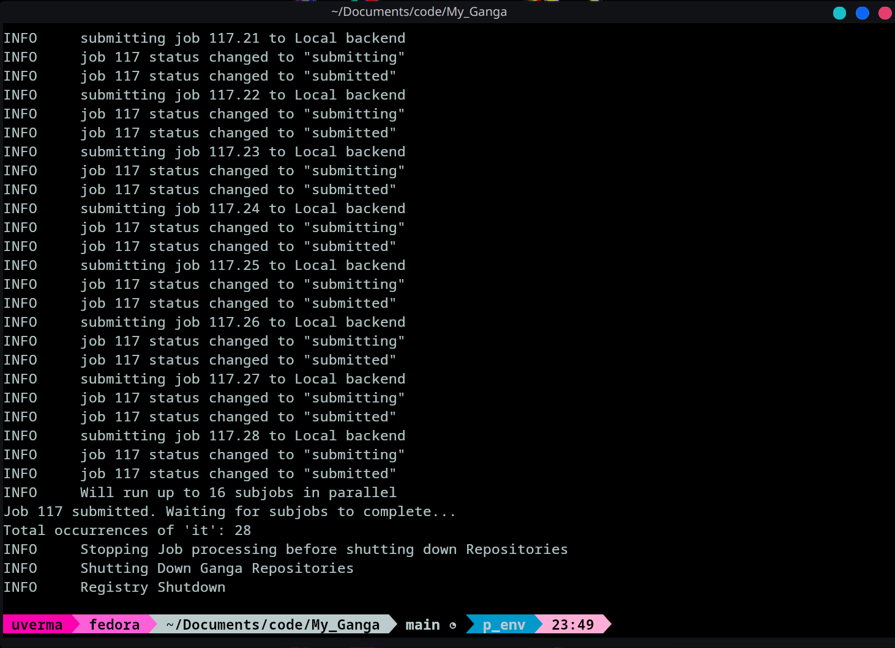

# **Ganga GSoC Evaluation Project**

## **Hello World Job**


### **Description**
This is a simple Ganga job that executes on a Local backend and prints "Hello, Ganga!" to demonstrate that the setup is working correctly.

***

## **LHC.pdf "it" Counting Job**  

### **Description**  
This task is handled by splitting it into three parts:  

- **Splitting the LHC.pdf using a script**  
  - A Python script **(split_pdf.py)** handles this using the **PyPDF2** library.  
  - It extracts each page and saves it as a separate PDF file.  

- **A Python script to count "it" occurrences**  
  - This script **(count_it)** loads each PDF page and counts occurrences of the word **"it"**.  
  - The script runs in parallel on multiple PDF pages using **Ganga's ArgSplitter**.  

- **Summing up results from all subjobs**  
  - After processing all PDFs, the individual counts are aggregated.  
  - The total count of **"it"** across the entire LHC.pdf is printed.  


### **Workflow**  
1. **Job 1 (J1) - Splitting LHC.pdf**  
   - Uses **split_pdf.py** to generate individual pages.  
2. **Job 2 (J2) - Counting "it" in each page**  
   - Runs **count_it.py** on each generated page.  
3. **Final Step - Summing Results**  
   - Aggregates the count from all subjobs and prints the total.  


### **Execution**  
To run the job, execute:  
```sh
ganga my_code/submit_jobs.py
```  
This submits the jobs and waits for completion.  

### The output should look something like this




### **File Structure**  
```
My_Ganga/
│── my_code/
│   ├── split_pdf.py      # Script to split LHC.pdf
│   ├── count_it.py       # Script to count occurrences of "it"
│   ├── submit_jobs.py    # Submits both the scripts and manages jobs
│   ├── output_pages/     # Stores individual PDF pages
│── gangadir/             # Ganga workspace
```
