# **Ganga Evaluation Project**

## **Hello World Job**


### **Description**
This is a simple Ganga job that executes on a Local backend and prints "Hello, Ganga!" to demonstrate that the setup is working correctly.

***

## **LHC.pdf "it" Counting Job**  

### **Description**  

This task is handled by splitting it into three parts:  

- **Splitting the LHC.pdf using a script**  
  - A Python script **(split_pdf.py)** handles this using the **PyPDF2** library.  
  - It extracts each page and saves it as a separate PDF file.  

- **A Python script to count "it" occurrences**  
  - This script **(count_it)** loads each PDF page and counts occurrences of the word **"it"**.  
  - The script runs in parallel on multiple PDF pages using **Ganga's ArgSplitter**.  

- **Summing up results from all subjobs**  
  - After processing all PDFs, the individual counts are aggregated.  
  - The total count of **"it"** across the entire LHC.pdf is printed.  


### **Workflow**  

1. **Job 1 (J1) - Splitting LHC.pdf**  
   - Uses **split_pdf.py** to generate individual pages.  
2. **Job 2 (J2) - Counting "it" in each page**  
   - Runs **count_it.py** on each generated page.  
3. **Final Step - Summing Results**  
   - Aggregates the count from all subjobs and prints the total.  


### **Execution**  

To run the job, execute:  

```sh
ganga my_code/submit_jobs.py
```  

This submits the jobs and waits for completion.  

### The output should look something like this

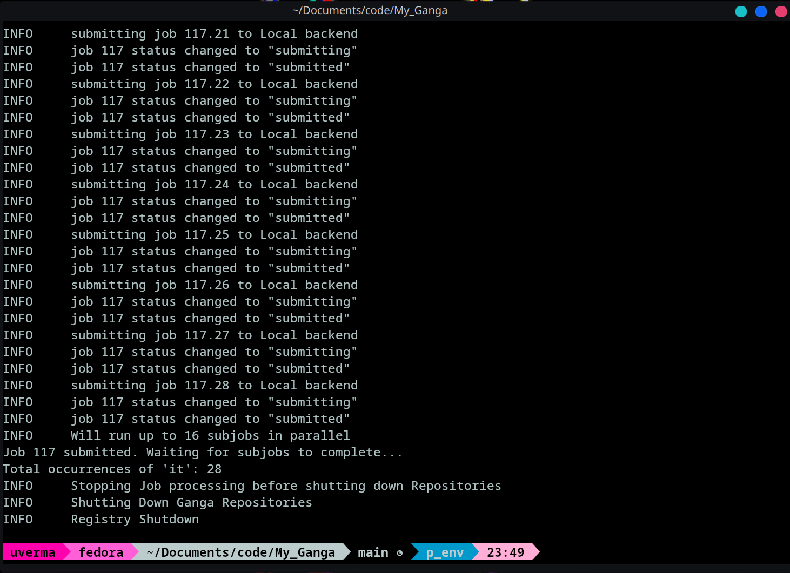


### **File Structure** 

```
My_Ganga/
│── my_code/
│   ├── split_pdf.py      # Script to split LHC.pdf
│   ├── count_it.py       # Script to count occurrences of "it"
│   ├── submit_jobs.py    # Submits both the scripts and manages jobs
│   ├── output_pages/     # Stores individual PDF pages
│── gangadir/             # Ganga workspace
```

***

## **Interfacing Ganga Job**

### **Description**

This task is to demonstrate programmatic interaction with a Large Language Model (LLM) to generate and execute a Ganga job. The generated job will calculate an approximation of π using the accept-reject simulation method. The total number of simulations will be 1 million, split into 1000 subjobs, each performing 1000 simulations.

### **Workflow Execution**

#### **Step 1: LLM Setup & Communication**

- Initialize interaction with the chosen LLM (deepseek-coder-v2:latest on Ollama CLI in this case).
- Install Ollama and deepseek-coder-v2:latest on Ollama
- - To install ollama on linux ,execute:  
    ```sh
    curl -fsSL https://ollama.com/install.sh | sh
    ``` 
- - To install and run deepseek-coder-v2:latest on Ollama CLI ,execute:  
    ```sh
    ollama run deepseek-coder-v2:latest
    ```

#### **Step 2: Prompting the LLM for Code Generation**

- Send a prompt to generate a structured prompt.

    ```
    generate me a prompt to get me a plan for "code that can execute a job in Ganga that will
    calculate an approximation to the number pi using an accept-reject simulation method will one
    million simulations. The job should be split into a number of subjobs that each do thousand
    simulations."

    ```
    
    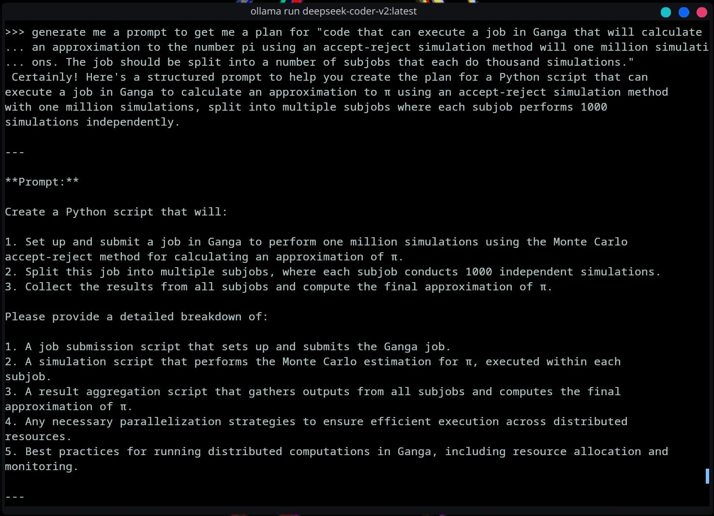
    
- Send the Structured prompt to generate the output.
    
    ```
    Create a Python script that will:

    1. Set up and submit a job in Ganga to perform one million simulations using the Monte Carlo 
    accept-reject method for calculating an approximation of π.
    2. Split this job into multiple subjobs, where each subjob conducts 1000 independent
    simulations.
    3. Collect the results from all subjobs and compute the final approximation of π.
    
    Please provide a detailed breakdown of:
    
    1. A job submission script that sets up and submits the Ganga job.
    2. A simulation script that performs the Monte Carlo estimation for π, executed within each 
    subjob.
    3. A result aggregation script that gathers outputs from all subjobs and computes the final 
    approximation of π.
    4. Any necessary parallelization strategies to ensure efficient execution across distributed 
    resources.
    5. Best practices for running distributed computations in Ganga, including resource allocation
    and monitoring.
    
    ```

    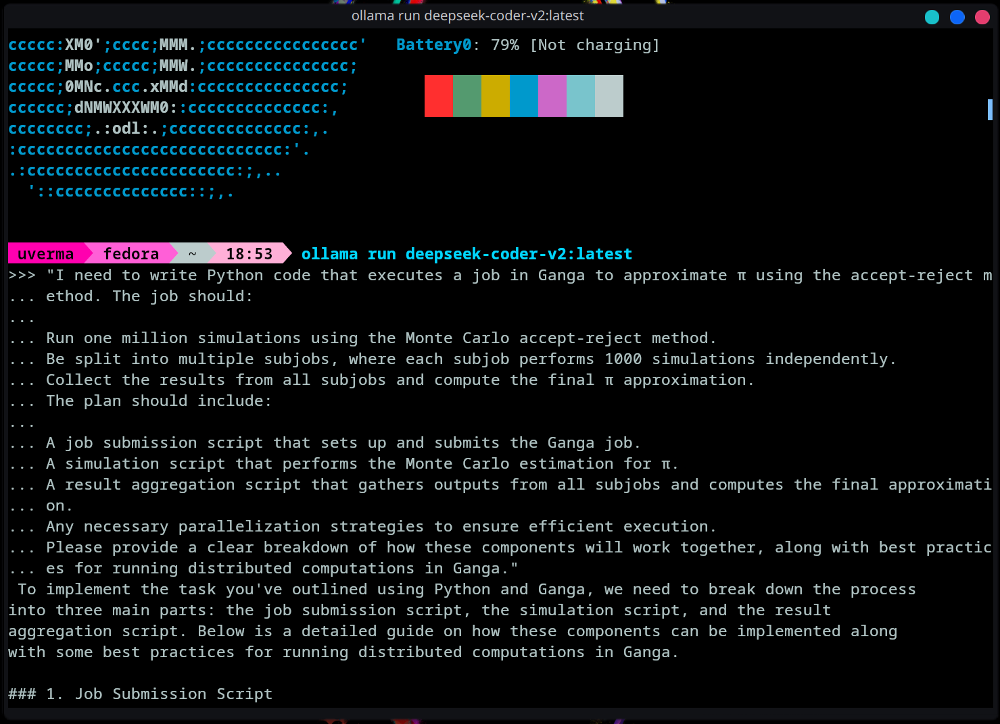
    
#### **Step 3: The LLM Output**

    To implement the task you've outlined using Python and Ganga, we need to break down the process
    into three main parts: the job submission script, the simulation script, and the result
    aggregation script. Below is a detailed guide on how these components can be implemented along
    with some best practices for running distributed computations in Ganga.
    
    ### 1. Job Submission Script
    The job submission script (`create_pi_job.py`) will set up and submit the Ganga job to run
    multiple 
    subjobs, each performing 1000 simulations independently. Here's how you can do it:
    
    ```python
    from GangaCore.GPI import Job, ArgSplitter, Local, Executable
    
    # Number of subjobs and simulations per subjob
    num_subjobs = 1000
    sims_per_subjob = 1000
    
    # Path to the simulation script
    simulation_script = "/path/to/project/scripts/pi_simulation.py"
    
    # Create the job
    j = Job(
        application=Executable(
            exe="/path/to/python"
        ),
        backend=Local(),
        splitter=ArgSplitter(
            args=[[simulation_script, str(sims_per_subjob)]] * num_subjobs  # Correctly format the
            args
        )
    )
    
    # Submit the job
    j.submit()
    
    ```
    
    ### 2. Simulation Script
    The simulation script (`pi_simulation.py`) will perform one instance of the Monte Carlo method 
    to approximate π:
    
    ```python
    import sys
    import random
    
    def monte_carlo_pi(num_samples):
        inside_circle = 0
    
        for _ in range(num_samples):
            x, y = random.uniform(-1, 1), random.uniform(-1, 1)
            if x**2 + y**2 <= 1:
                inside_circle += 1
    
        return (inside_circle / num_samples) * 4  # π approximation
    
    if __name__ == "__main__":
        num_samples = int(sys.argv[1])
        pi_estimate = monte_carlo_pi(num_samples)
        
        # Print result to stdout (Ganga will capture this)
        print(pi_estimate)
    
    ```
    
    ### 3. Result Aggregation Script
    The result aggregation script (`pi_merger.py`) will collect the results from all subjobs 
    and compute the final approximation of π:
    
    ```python
    import os
    
    total_pi = 0
    subjob_count = 0
    
    # Base path where Ganga stores job output
    base_dir = "/path/to/gangadir/workspace/user/LocalXML"
    
    # Change this to your actual job ID
    job_id = __  # Make sure this is correct!
    
    # Path to the job's output directory
    job_output_dir = os.path.join(base_dir, str(job_id))
    
    # Iterate over all subjobs
    for subjob_id in range(1000):  
        output_file = os.path.join(job_output_dir, str(subjob_id), "output", "stdout")
        
        if os.path.exists(output_file):
            with open(output_file, "r") as f:
                try:
                    pi_value = float(f.read().strip())
                    total_pi += pi_value
                    subjob_count += 1
                except ValueError:
                    print(f"Skipping subjob {subjob_id}: Invalid output")
        else:
            print(f"Skipping subjob {subjob_id}: stdout file not found at {output_file}")
    
    # Compute final approximation
    if subjob_count > 0:
        final_pi = total_pi / subjob_count
        print(f"Final π approximation: {final_pi}")
    else:
        print("No valid results found!")
    
    ```
    
    ### Best Practices for Running Distributed Computations in Ganga
    - **Efficient Subjob Splitting**: Ensure that the subjobs are balanced and do not overload the 
    system by creating too many small jobs. You can adjust `subjobs_per_job` based on your
    resources.
    - **Error Handling**: Implement error handling to manage failed subjobs gracefully. This can
    help 
    in debugging and ensuring data integrity.
    - **Output Data Management**: Store or log results from each simulation for later reference, 
    especially important if the simulations are resource-intensive or time-consuming.
    - **Resource Allocation**: Make sure that your computational resources (like CPU, memory) are 
    appropriately allocated to avoid overloading the system.
    - **Monitoring and Logging**: Use Ganga's built-in tools to monitor job status and logs for 
    debugging purposes. This is crucial when dealing with distributed computations.
    
    This setup should help you efficiently run a large number of Monte Carlo simulations to 
    approximate π using Ganga, following best practices in parallel computing and resource
    management.

#### **Step 4: Parsing the output code**

Make 3 python files as follows with the code provided above.
 
    1. create_pi_job.py
    2. pi_merger.py
    3. pi_simulation.py
    
**MAKE SURE THE JOB_ID IS SET CORRECTLY** 

**MAKE SURE THE ADRESSES IN THE CODE ARE CORRECT**

#### **Step 5: Run the code**

- To run *create_pi_job.py* in ganga , run:
  
  ```sh
  ganga path/to/create_pi_job.py 
  ```

  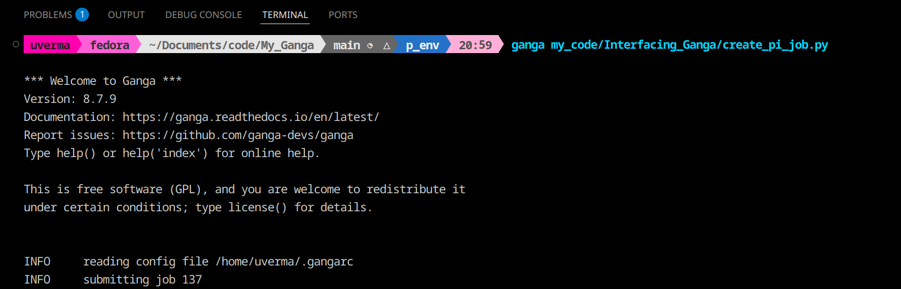

- To run *pi_merger.py* in ganga , run:

  ```sh
  python path/to/pi_merger.py
  ```

  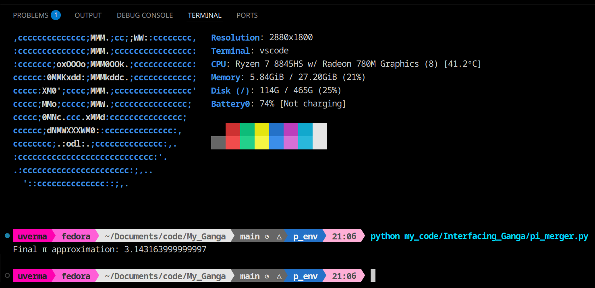

***

## **LLM Django interfacing**

### **Description**  

This project involves creating a Django web application that interacts with a **local LLM (Large Language Model)** to answer user questions. The app:

1.  Accept questions via **HTTP** (GET/POST)  
2.  Used **_deepseek-coder-v2:latest_** via Ollama CLI
3.  Return **LLM-generated responses** without maintaining chat history

### **Usage**  

1.  **Start the Django App**    
    
    Run the Django development server:  
    ```bash
    python manage.py runserver

    ```

2.  **Interact with the LLM API**   
    
    -   Using a **_Web Browser_** :
        -   Open http://127.0.0.1:8000/chat/ in your browser.
        -   Enter a question and get a response.

    -   Using **curl (Command Line)** :

        -   Send a question via **_curl_** :
        
        ```bash
        curl -X POST http://127.0.0.1:8000/chat/query/ -H "Content-Type: application/json" -d
        '{"question":"Inset your question here"}'

         ```
         
        -   Expected response:
        
        ```json
        {
        "response": "LLM output response"
        }
        ```

### **Demo**

*Start the Django App*

1.  **Using Web Browser**
    
    [Watch the full Demo](https://github.com/Sigma-Verma/My_Ganga/blob/main/images/LLM_chat_DEMO.webm)
    
    -   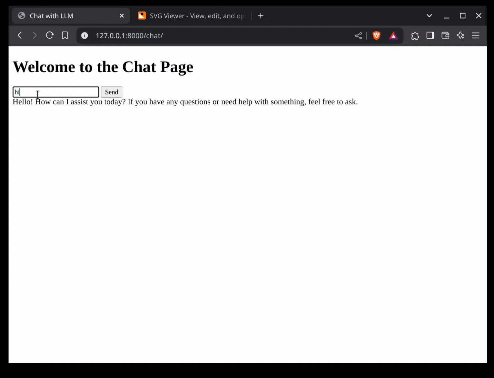
    -   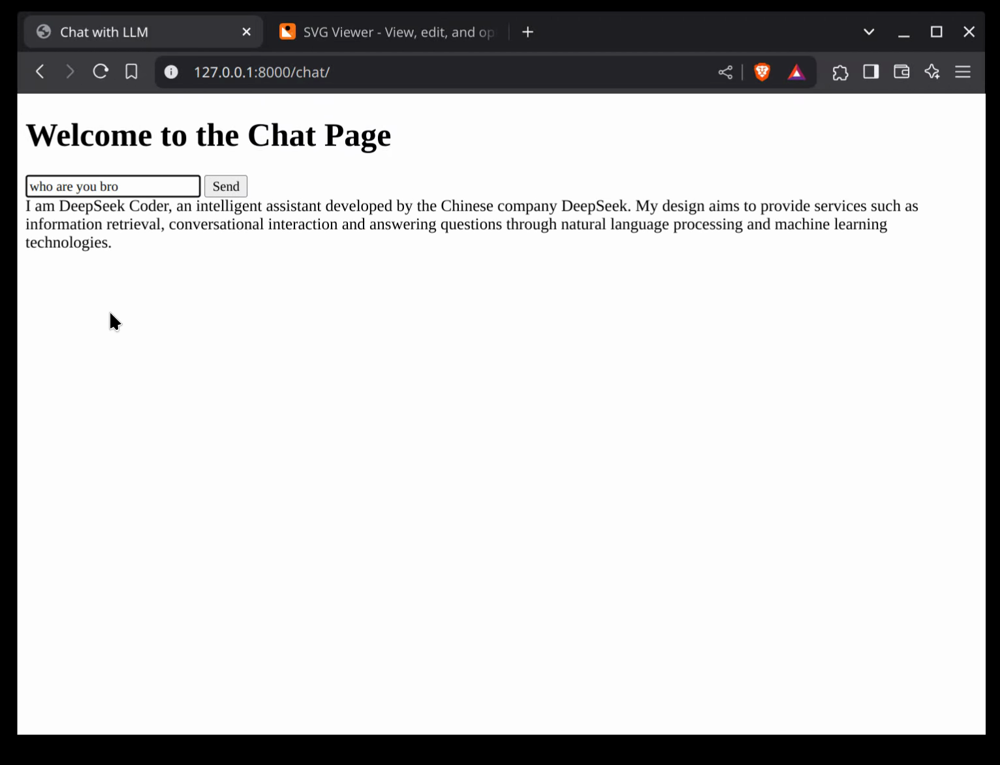
    -   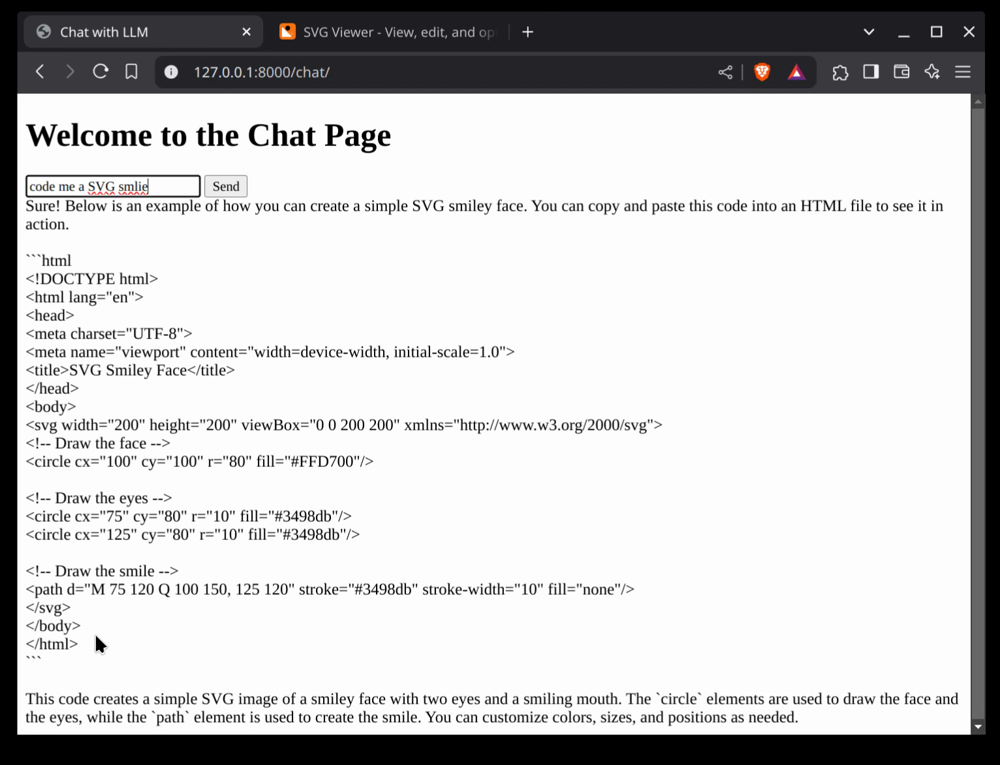
    -   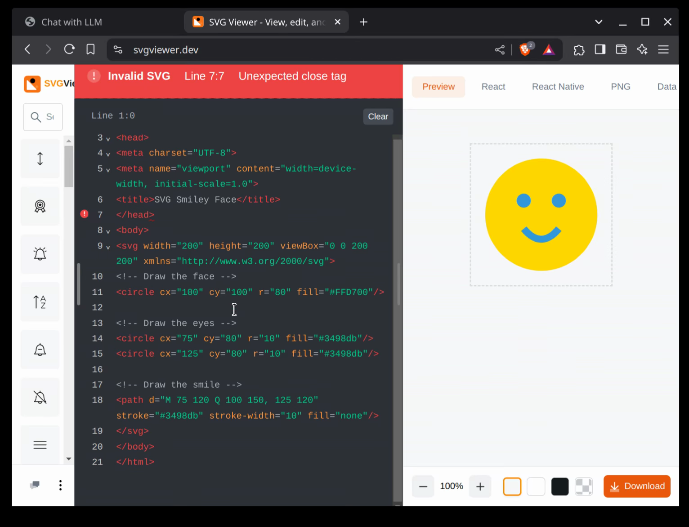
    -   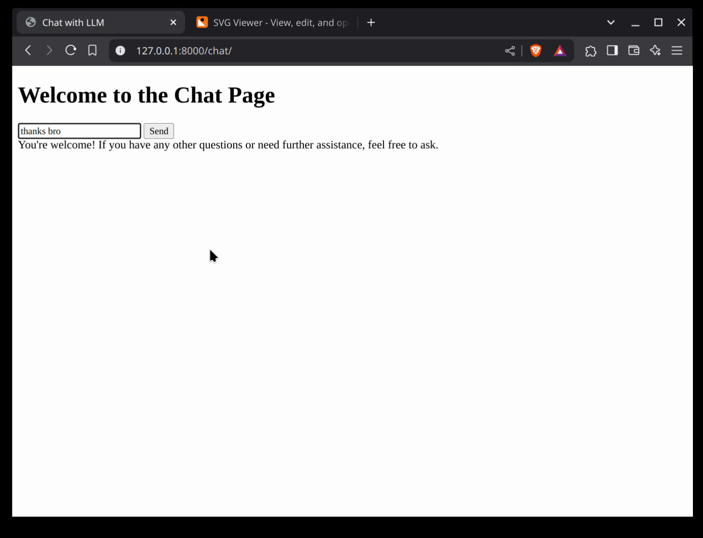

2.  **Using curl (Command Line)**
    
    [Watch the full Demo](https://github.com/Sigma-Verma/My_Ganga/blob/main/images/LLM_curl_DEMO.webm)

    -   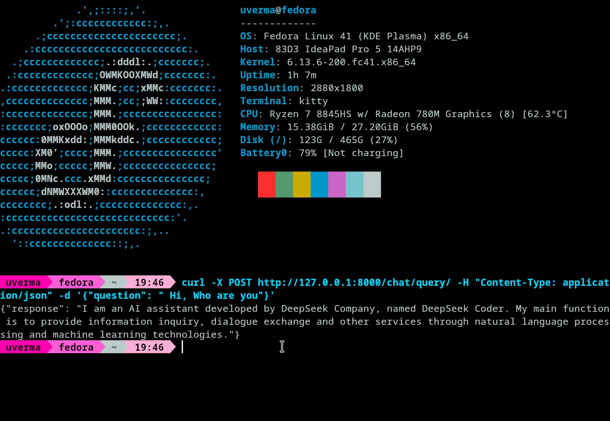
    -   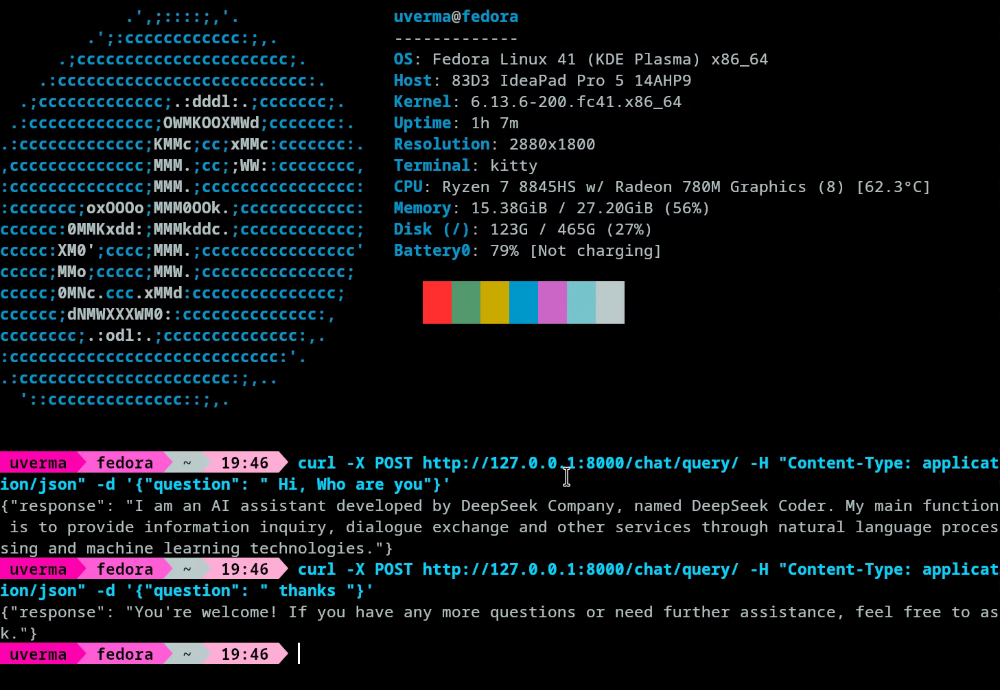

### **Project Structure** 

```
ollama_django/
│── chat/
│   ├── templates/chat/index.html   # Frontend UI  
│   ├── views.py                    # Backend logic  
│   ├── urls.py                     # URL routing  
│── ollama_django/
│   ├── settings.py                 # Django settings  
│── manage.py                       # Django entry point  

```

### **Possible Updates** 

-   Add **conversation memory** to enable context-aware interactions.
-   Enhance security by **implementing authentication and HTTPS**.
-   **Improve UI** with a frontend framework.
-   Support **multiple LLMs**, allowing users to choose different models.
-   **Integrate a database** to store chat logs for future analysis.


